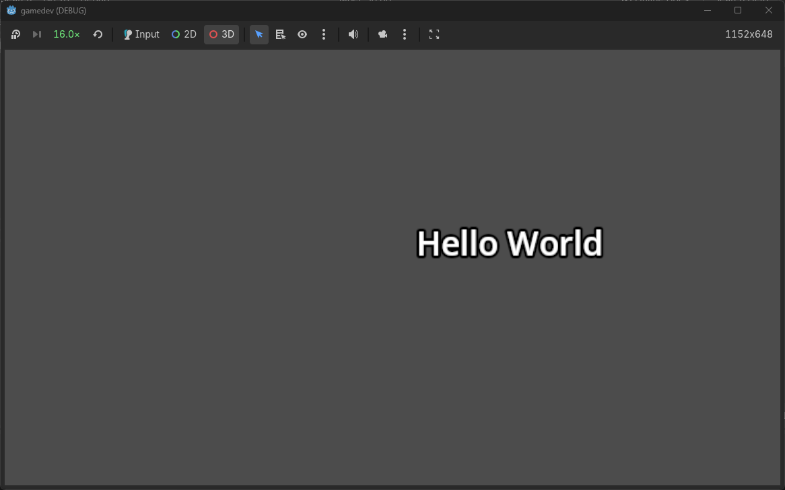
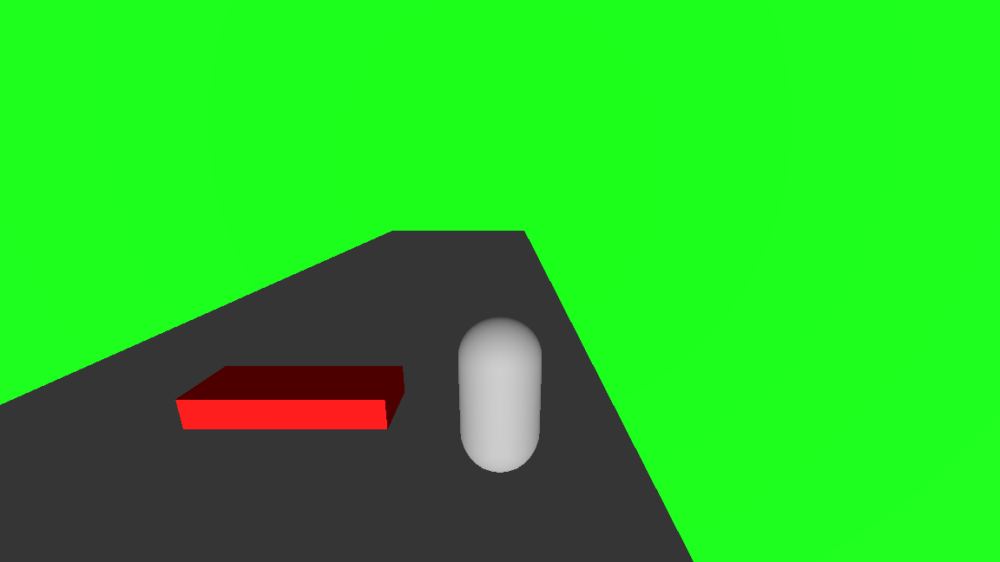
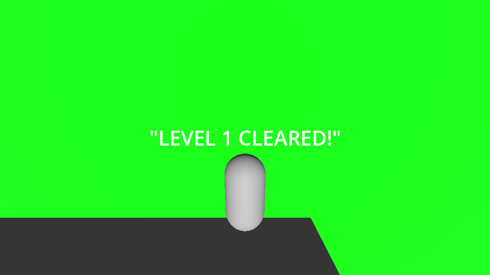
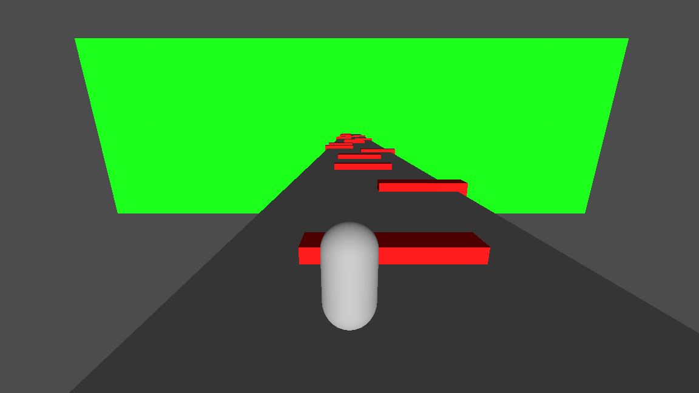
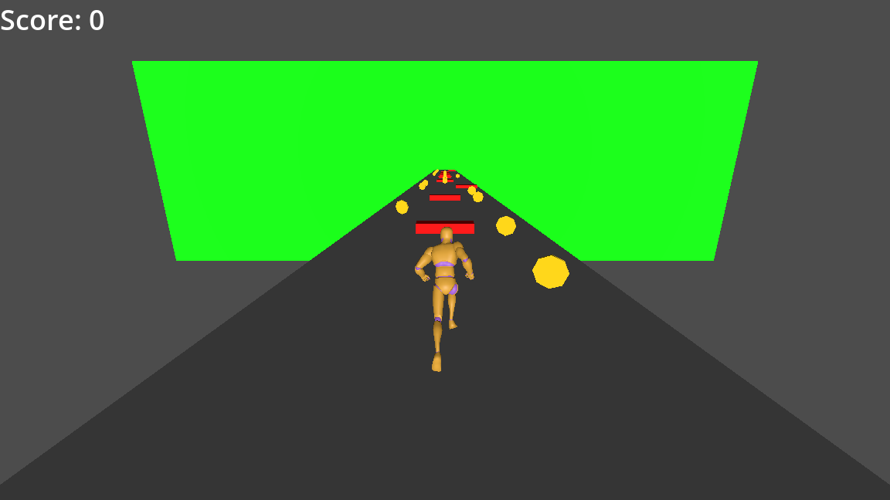

# Game Development

This repository contains a series of incremental game development activities built in the Godot Engine, progressing from basic scenes to a multi-level game prototype featuring custom animations, audio, and minimal UI.

## Week 1: Simple Scene with a Moving Node

- **Objective:** Establish engine familiarity and version control.
- **Details:** A basic Godot scene containing a `Label` node that displays "hello world". A GDScript is attached using the `_process(delta)` function to continuously update its X-axis position.
- **Screenshot:**
  

## Week 2: Gameplay Mechanics & Level Design

- **Mechanics:** Implemented a player controller utilizing physics bodies and collision detection. The character can move and jump using mapped inputs.
- **Level Design:** Designed a two-level endless runner prototype.
  - **Level 1:** Introductory difficulty.
  - **Level 2:** Noticeably harder, triggered via a scene transition with an on-screen notification.
  - **Hazards:** Implemented traps using Area nodes. The game features no HP; colliding with a trap triggers an immediate scene reload.
- **Screenshot:**
  
  
  

## Week 3: Animations, Audio, & Minimal UI

- **Animations:** Replaced placeholder meshes with a rigged 3D humanoid model. Implemented dynamic animation states (sprinting, jumping, falling) that blend and transition based on physics constraints, player input, and vertical velocity.
- **Audio:** Integrated basic sound effects for gameplay events (e.g., object collection) using `AudioStreamPlayer`, managing node lifecycle to ensure sounds complete before objects are removed.
- **UI:** Integrated a minimal HUD with a basic persistent score counter to track collected objects globally across scenes.
- **Screenshot:**
  
